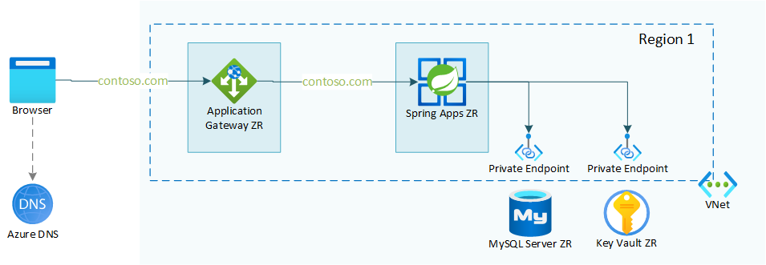

# Azure Spring Apps multi zone reference architecture

This sample contains a Terraform template that deploys a working sample of the Azure architecture center reference architecture: [Multi zone Azure Spring Apps reference architecture (coming up)](coming up). The reference architecture and sample show how to run an Azure Spring Apps workload in a multi zone configuration. This allows for higher availability of the workload.

This sample also applies a proper reverse proxy configuration with [host name preservation](https://learn.microsoft.com/azure/architecture/best-practices/host-name-preservation). This means that cookies and AAD redirects will be working as expected.

## Features

This project framework provides the following features:

- Multi-zone Spring Apps deployment with VNet integration
- Proper reverse proxy configuration for Application Gateway with a custom domain
- Integration with Key Vault
- Integration with a MySQL database

## Getting Started

### Prerequisites

Before you begin, make sure you have the following available:

- Azure Subscription with Contributor access
- Azure Active Directory access
- optional:
  - pfx certificate for your custom domain
  - GitHub Personal Access Token

> [NOTE!]
> There is also an option to install this infrastructure with a self-signed certificate. This certificate will be generated for you during the deployment. However, this setup should only be used in testing scenario's.

To deploy the infrastructure, you can either make use of a locally installed environment, or you can make use of a pre-configured dev container.

When executing locally, make sure you have the following installed:

- Latest version of [Terraform](https://learn.hashicorp.com/tutorials/terraform/install-cli)
- Latest version of [AZ CLI](https://learn.microsoft.com/en-us/cli/azure/install-azure-cli)

When using the dev container, either make sure you have [GitHub Codespaces](https://docs.github.com/codespaces/overview) enabled in your GitHub organization, or you can start up the dev container locally with the [Visual Studio Code Remote Containers](https://code.visualstudio.com/docs/remote/containers) extension.

### Installation

This sample can be set up in a test or a non-test setup.

- [test set up]: In this case the Git PAT token is optional and a self-signed certificate is used. Walkthrough of this setup is found in the [install-test.md](docs/install-test.md) file.
- [non-test set up]: In this case the Git PAT token is mandatory and a pfx certificate for your custom domain is used. Walkthrough of this setup is found in the [install-prod.md](docs/install-prod.md) file.

### What you need to know about this setup

More info on how the terraform templates are build and how they operate can be found in the [docs](docs) folder of this repository. Best starting point is the [maintf.md](docs/maintf.md) file.

### Coming up

We are working on improving this sample. The ideas we have on improving:

- Create Bicep templates for the same setup (in progress)
- Make the database interchangeable for other types of databases (Cosmos DB as a first candidate)
- Currently the apps in Azure Spring Apps are based on the Spring Petclinic sample, these apps should be better configurable.

## Resources

- [Azure Architecture Center: Multi-region Azure Spring Apps reference architecture(coming up)](article coming up)
- [Preserve the original HTTP host name between a reverse proxy and its back-end web application](https://learn.microsoft.com/azure/architecture/best-practices/host-name-preservation)
- A similar automated setup in multiple regions can be found in the [Azure Spring Apps multi region reference architecture](https://github.com/vermegi/azure-spring-apps-multi-region) GitHub repository with more info in the [Deploy Azure Spring Apps to multiple regions](https://learn.microsoft.com/azure/architecture/reference-architectures/microservices/spring-apps-multi-region) architecture center article.
